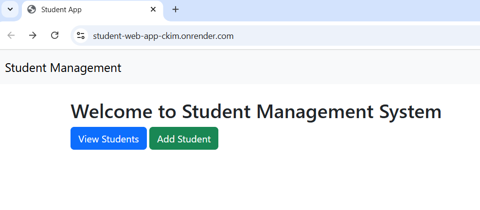
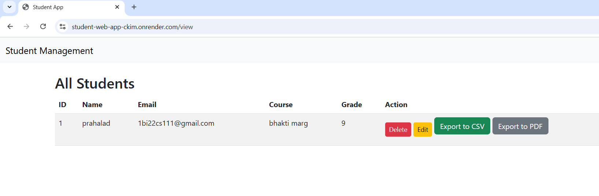
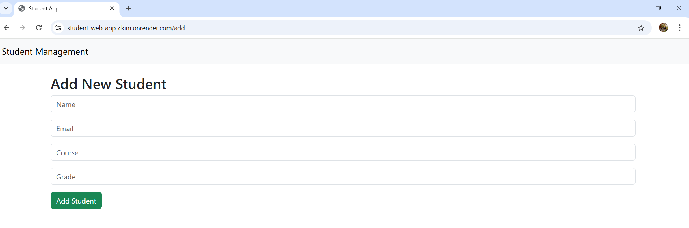

# Student Management Web App

A CRUD-based **Student Management System** built with **Flask, SQLite, HTML, CSS, and Bootstrap**.  
The application allows users to manage student records efficiently with features like adding, editing, updating, deleting, and exporting data.

---

## 🚀 Features
- Add new student records
- View all student records
- Update existing records
- Delete records
- Export student data to **CSV** (using Python's `csv` module)
- Export student data to **PDF** (using ReportLab)
- Responsive UI with **Bootstrap**
- Deployed live on **Render**

---

## 🛠️ Tech Stack
- **Backend:** Python (Flask)
- **Frontend:** HTML, CSS, Bootstrap
- **Database:** SQLite
- **Export:** CSV module, ReportLab
- **Deployment:** Render

---

## 📂 Project Structure
student-management-app/
│
├── app.py # Main Flask application
├── templates/ # HTML templates (Jinja2)
│ ├── index.html
│ ├── add.html
│ ├── edit.html
│ └── view.html
├── static/ # CSS, JS, Images
├── students.db # SQLite database
├── requirements.txt # Dependencies
└── README.md # Project documentation

📸 Screenshots

## 🚀 Live Demo

You can try the project here: [Student Management Web App](https://student-web-app-ckim.onrender.com)

👨‍💻 Author

Pramith L

